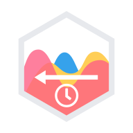

<p align="center">
  
</p>

# chartjs-plugin-streaming

[](https://npmjs.com/package/chartjs-plugin-streaming) [](https://github.com/nagix/chartjs-plugin-streaming/actions?query=workflow%3ACI+branch%3Amaster) [](https://codeclimate.com/github/nagix/chartjs-plugin-streaming) [](https://github.com/chartjs/awesome)

*[Chart.js](https://www.chartjs.org) plugin for live streaming data*

chartjs-plugin-streaming 2.x requires Chart.js 3.0.0 or later. If you need Chart.js 2.x support, use the following versions.

- For Chart.js 2.9.x, 2.8.x or 2.7.x, use [version 1.9.0](https://github.com/nagix/chartjs-plugin-streaming/releases/tag/v1.9.0) ([tutorials](https://nagix.github.io/chartjs-plugin-streaming/1.9.0/) and [samples](https://nagix.github.io/chartjs-plugin-streaming/1.9.0/samples/))
- For Chart.js 2.6.x, use [version 1.2.0](https://github.com/nagix/chartjs-plugin-streaming/releases/tag/v1.2.0)

## Documentation

- [Introduction](https://nagix.github.io/chartjs-plugin-streaming/master/guide/)
- [Getting Started](https://nagix.github.io/chartjs-plugin-streaming/master/guide/getting-started.html)
- [Options](https://nagix.github.io/chartjs-plugin-streaming/master/guide/options.html)
- [Data Feed Models](https://nagix.github.io/chartjs-plugin-streaming/master/guide/data-feed-models.html)
- [Integration](https://nagix.github.io/chartjs-plugin-streaming/master/guide/integration.html)
- [Performance](https://nagix.github.io/chartjs-plugin-streaming/master/guide/performance.html)
- [Migration](https://nagix.github.io/chartjs-plugin-streaming/master/guide/migration.html)
- [Tutorials](https://nagix.github.io/chartjs-plugin-streaming/master/tutorials/)
- [Samples](https://nagix.github.io/chartjs-plugin-streaming/master/samples/)

## Development

You first need to install node dependencies (requires [Node.js](https://nodejs.org/)):

```bash
npm install
```

The following commands will then be available from the repository root:

```bash
npm run build      # build dist files
npm run build:dev  # build and watch for changes
npm run lint       # perform code linting
npm run package    # create an archive with dist files
npm run docs       # generate documentation (`dist/docs`)
npm run docs:dev   # generate documentation and watch for changes
```

## License

chartjs-plugin-streaming is available under the [MIT license](https://opensource.org/licenses/MIT).
